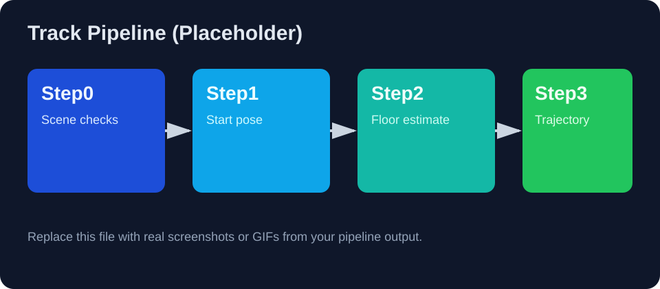

# Track-Generation


[](https://github.com/OWNER/Track-Generation/actions/workflows/ci.yml)
[](LICENSE)
[](https://www.python.org/downloads/)

> 基于 Habitat-Sim 的室内场景四阶段批处理轨迹生成工具链（scene 预检查 → 初始视点 → 地面估计 → 连续轨迹采样）。

## 项目动机
在 3D 场景数据集构建中，轨迹生成常面临以下问题：
- 场景资产质量不一致，批处理时容易中断。
- 初始相机位姿和可导航区域质量波动较大。
- 一次性脚本难以定位故障步骤和复现问题。

Track-Generation 将流程拆分为 4 个可复跑步骤，并在每一步输出报告、日志和汇总表，帮助你更稳定地跑批量数据。

## 特性
- 四阶段流水线：`step0` / `step1` / `step2` / `step3`。
- 批处理摘要：每一步输出 `_batch_summary.tsv` 便于筛查失败样本。
- 可恢复运行：支持日志与中间 JSON 报告，便于断点排查。
- 面向 Habitat-Sim：支持 `scene_instance`/`glb` 场景输入。
- 低侵入：核心逻辑按步骤分离，便于替换单阶段策略。

## 示例图
> 当前仓库使用占位图，请替换为你自己的截图 / GIF。



## 安装

### 1) 克隆仓库
```bash
git clone https://github.com/OWNER/Track-Generation.git
cd Track-Generation
```

### 2) 准备 Python 环境
建议使用 Python 3.10+：

```bash
python -m venv .venv
source .venv/bin/activate
pip install -U pip
```

### 3) 安装依赖
本项目脚本依赖（至少）以下包：
- `habitat-sim`
- `numpy`
- `Pillow`
- `magnum`

> 说明：`habitat-sim` 安装依赖系统环境（CUDA/GL 等），请优先参考 Habitat 官方安装文档。

## 运行

### 最小示例（单场景 Step0）
```bash
python scripts/run_step0_batch.py \
  --scene-path /path/to/scene.glb \
  --output-root ./output
```

### 典型顺序（Step0 → Step3）
```bash
python scripts/run_step0_batch.py --help
python scripts/run_step1_batch.py --help
python scripts/run_step2_batch.py --help
python scripts/run_step3_batch.py --help
```

## 配置说明
当前脚本内部包含默认路径常量（例如 `ROOT`、`DEFAULT_OUTPUT_ROOT`）。运行前建议：
1. 优先通过命令行参数覆盖输入 / 输出路径。
2. 如需固定本地环境，可在脚本中将 `ROOT` 改为你的数据根目录。
3. 批处理时，统一将输出写入独立目录，避免与历史结果混淆。

## FAQ

### Q1: 为什么运行时报错找不到 scene / stage 资产？
A: 请先检查 `scene_instance.json` 中 `template_name`、`render_asset`、`collision_asset` 的相对路径是否可解析。

### Q2: 为什么 step1/2/3 没有产出？
A: 这些步骤依赖上一步生成的报告文件；请先确认上一步 `_batch_summary.tsv` 状态为成功。

### Q3: CI 为什么只做基础检查？
A: Habitat-Sim 依赖较重，默认 CI 先做 `ruff` 静态检查和 `compileall` 语法检查。集成测试建议在具备图形/仿真依赖的 runner 上扩展。

## 路线图
- [ ] 增加 `pyproject.toml` 与可复用的依赖锁定。
- [ ] 提供 Docker / DevContainer 环境。
- [ ] 增加端到端 smoke test（小型示例场景）。
- [ ] 补充真实运行截图 / GIF。
- [ ] 支持可配置化（环境变量 / YAML）替代硬编码路径。

## 开源协作
- 贡献指南：[`CONTRIBUTING.md`](CONTRIBUTING.md)
- 行为准则：[`CODE_OF_CONDUCT.md`](CODE_OF_CONDUCT.md)
- 安全策略：[`SECURITY.md`](SECURITY.md)
- 变更日志：[`CHANGELOG.md`](CHANGELOG.md)

## License
本项目采用 [MIT License](LICENSE)。
